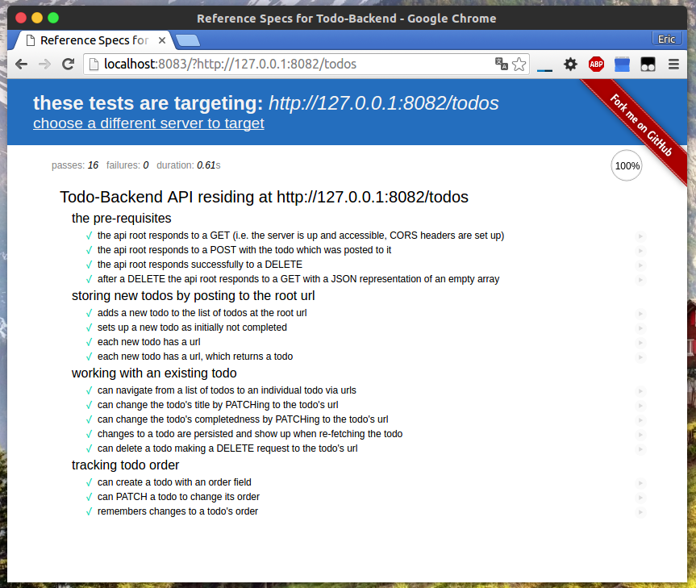

# vertx-blueprint-todo-backend

Vert.x blueprint application - A todo-backend implementation using Vert.x 
and various persistence(e.g. Redis or MySQL).

## Introduction
This repository is an introduction to basic Vert.x web RESTful service development.
Detailed documents(both in Chinese and English) are provided below.

## Detailed Document

- [English Version](docs/doc-en.md)
- [中文文档](docs/doc-zh-cn.md)

## Building

To build the code:

    gradle build

To build and run with Docker:

    gradle build
    docker build -t sczyh30/vert-todo-backend .

## OpenShift

- [OpenShift Live Demo URL](http://verttodo-sczyh30.rhcloud.com/todos)
- [API Test](http://www.todobackend.com/specs/index.html?http://verttodo-sczyh30.rhcloud.com/todos)
- [Client Test](http://www.todobackend.com/client/index.html?http://verttodo-sczyh30.rhcloud.com/todos)

## API Test

Test result of the RESTful API (using [todo-backend-js-spec](https://github.com/TodoBackend/todo-backend-js-spec)):

