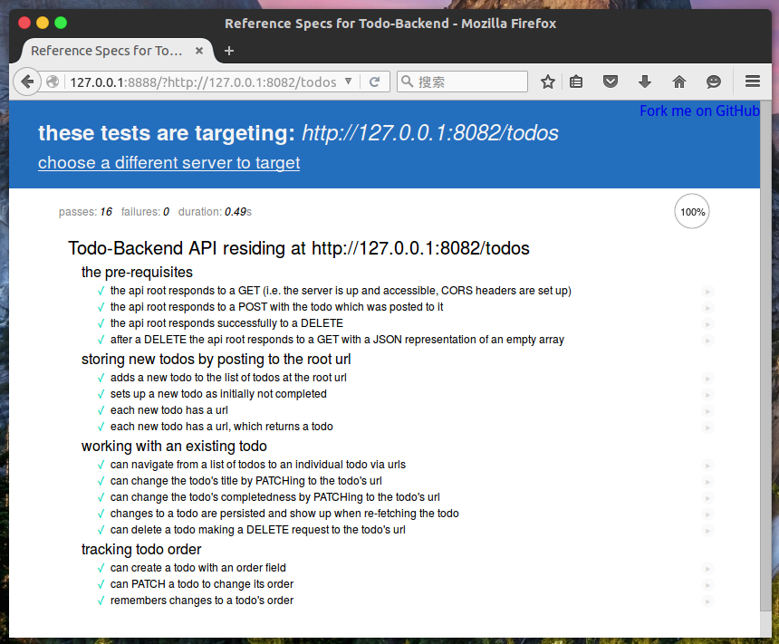

# Vert.x Blueprint - Todo-Backend Tutorial

## Table of contents

- [Preface](#preface)
- [Introduction to Vert.x](#introduction-to-vertx)
- [Our application - Todo service](#our-application---todo-service)
- [Let's Start!](#lets-start)
    - [Gradle build file](#gradle-build-file)
    - [Todo entity](#todo-entity)
    - [Verticle](#verticle)
- [REST API with Vert.x Web](#rest-api-with-vertx-web)
    - [Create HTTP server with route](#create-http-server-with-route)
    - [Configure the routes](#configure-the-routes)
    - [Asynchronous Pattern](#asynchronous-pattern)
    - [Todo logic implementation](#todo-logic-implementation)
        - [Vert.x Redis](#vertx-redis)
        - [Store format](#store-format)
        - [Get/Get all](#getget-all)
        - [Create Todo](#create-todo)
        - [Update](#update)
        - [Remove/Remove all](#removeremove-all)
    - [Launcher Class](#launcher-class)
    - [Package](#package)
    - [Run our service](#run-our-service)
- [Decouple controller and service](#decouple-controller-and-service)
    - [Asynchronous service using Future](#asynchronous-service-using-future)
    - [Refactor!](#refactor)
    - [Implement our service with Vert.x-Redis](#implement-our-service-with-vertx-redis)
    - [Implement our service with Vert.x-JDBC](#implement-our-service-with-vertx-jdbc)
    - [Run!](#run)
- [Cheers!](#cheers)
- [From other frameworks?](#from-other-frameworks)


## Preface

In this tutorial, we are going to develop a RESTful web service - Todo Backend. This service provide a simple RESTful API in the form of a todo list, which we could add or complete todo stuff.

What you are going to learn:

- What is Vert.x and its basic design
- What is and how to use `Verticle`
- How to develop a REST API using Vert.x Web
- How to make use of *asynchronous development model*
- How to use persistence such as *Redis* and *MySQL* with the help of Vert.x data access components

This is the first part of Vert.x Blueprint. The code developed in this tutorial is available on [GitHub](https://github.com/sczyh30/vertx-blueprint-todo-backend/tree/master).

## Introduction to Vert.x

Welcome to the world of Vert.x! When you first heard about Vert.x, you must be wondering: what's this?

Let's move on the definition of Vert.x:

> Vert.x is a tool-kit for building reactive applications on the JVM.

(⊙o⊙)... Toolkit? Reactive? Seems so fuzzy... Let's explain these words in brief. **"Toolkit"** means that it's lightweight. It could be embedded in your current application without changing the structure.
Another significant word is **reactive**. Vert.x is made to build reactive systems. Reactive system has been defined in the [Reactive Manifesto](http://reactivemanifesto.org/). We could summarize it in 4 points:

- **Responsive** : The system responds in a timely manner if at all possible.
- **Resilient** : The system stays responsive in the face of failure (e.g. internal error).
- **Elastic** : The system stays responsive under varying workload.
- **Message Driven:** The components of the system communicate with each other using [asynchronous message-passing](http://www.reactivemanifesto.org/glossary#Asynchronous).

Vert.x is event driven and non-blocking. First, let's introduce **Event Loop** thread. Event loops are a group of threads that are responsible for dispatching and handling events in `Handler`. Every event is delivered and handled in an event loop. Notice, we **must never block the event loop** or our application will not be responsive as the process of handling events will be blocked. When building Vert.x applications, we should keep the asynchronous and non-blocking model in mind, rather than traditional blocking model. We will see the detail in the following sections.

## Our application - Todo service

Our application is a todo list REST service. It's very simple. The entire API consists of about 5 distinct operations (create a todo, view a todo, modify a todo, list all todos, delete all todos), which correspond to CRUD operations.

So we could design the following routes:

- Add a todo entity: `POST /todos`
- Get a certain todo entity: `GET /todos/:todoId`
- Get all todo entities: `GET /todos`
- Update a todo entity: `PATCH /todos/:todoId`
- Delete a certain todo entity: `DELETE /todos/:todoId`
- Delete all todo entities: `DELETE /todos`

The level of *REST* of the API is not the topic of this post, so you could also design as you like.

Now let's start!

## Let's Start!

Vert.x core provides a fairly low level set of functionality for handling HTTP, and for some applications that will be sufficient. That's the main reason behind [Vert.x Web](http://vertx.io/docs/vertx-web/java). Vert.x-Web builds on Vert.x core to provide a richer set of functionality for building real web applications, more easily.

### Gradle build file

First, let's create the project. In this tutorial we use Gradle as build tool, but you can use any other build tools you prefer, such as Maven and SBT. Basically, you need a directory with:

1. a `src/main/java` directory
2. a `src/test/java` directory
3. a `build.gradle` file

The directory tree will be like this:

```
.
├── build.gradle
├── settings.gradle
├── src
│   ├── main
│   │   └── java
│   └── test
│       └── java
```

Let's create the `build.gradle` file:

```groovy
apply plugin: 'java'

targetCompatibility = 1.8
sourceCompatibility = 1.8

repositories {
  mavenCentral()
  mavenLocal()
}

dependencies {

  compile "io.vertx:vertx-core:3.2.1"
  compile 'io.vertx:vertx-web:3.2.1'

  testCompile group: 'junit', name: 'junit', version: '4.12'
}
```

You might not be familiar with Gradle, that doesn't matter. Let's explain that:

- We set both `targetCompatibility` and `sourceCompatibility` to **1.8**. This point is **important** as Vert.x requires Java 8.
- In `dependencies` field, we declares our dependencies. `vertx-core` and `vert-web` for REST API.

As we created `build.gradle`, let's start writing code~

### Todo entity

First we need to create our data object - the `Todo` entity. Create the `src/main/java/io/vertx/blueprint/todolist/entity/Todo.java` file and write:

```Java
package io.vertx.blueprint.todolist.entity;


public class Todo {

  private int id;
  private String title;
  private Boolean completed;
  private Integer order;
  private String url;

  public Todo() {
  }

  public Todo(int id, String title, Boolean completed, Integer order, String url) {
    this.id = id;
    this.title = title;
    this.completed = completed;
    this.order = order;
    this.url = url;
  }

  public int getId() {
    return id;
  }

  public void setId(int id) {
    this.id = id;
  }

  public String getTitle() {
    return title;
  }

  public void setTitle(String title) {
    this.title = title;
  }

  public Boolean isCompleted() {
    return getOrElse(completed, false);
  }

  public void setCompleted(Boolean completed) {
    this.completed = completed;
  }

  public Integer getOrder() {
    return getOrElse(order, 0);
  }

  public void setOrder(Integer order) {
    this.order = order;
  }

  public String getUrl() {
    return url;
  }

  public void setUrl(String url) {
    this.url = url;
  }


  private <T> T getOrElse(T value, T defaultValue) {
    return value == null ? defaultValue : value;
  }

  public Todo merge(Todo todo) {
    return new Todo(id,
      getOrElse(todo.title, title),
      getOrElse(todo.completed, completed),
      getOrElse(todo.order, order),
      url);
  }
}
```

Our `Todo` entity consists of id, title, order, url and a flag indicates if it is completed. This is a simple Java bean and could be marshaled to JSON format.

### Verticle

Then we start writing our verticle. Create the `src/main/java/io/vertx/blueprint/todolist/verticles/SingleApplicationVerticle.java ` file and write following content:

```java
package io.vertx.blueprint.todolist.verticles;

import io.vertx.core.AbstractVerticle;
import io.vertx.core.Future;
import io.vertx.redis.RedisClient;
import io.vertx.redis.RedisOptions;

public class SingleApplicationVerticle extends AbstractVerticle {

  private static final String HOST = "127.0.0.1";
  private static final int PORT = 8082;

  private final RedisClient redis;

  public SingleApplicationVerticle(RedisOptions redisOptions) {
    this.redis = RedisClient.create(Vertx.vertx(), redisOptions);
  }

  @Override
  public void start(Future<Void> future) throws Exception {
      // TODO with start...
  }
}
```

Our class `SingleApplicationVerticle` extends `AbstractVerticle` class. In Vert.x, a **verticle** is a component of the application. We can deploy *verticles* to run the components.

The `start` method will be called when verticle is deployed. And notice this `start` method takes a parameter typed `Future<Void>`, which means this is asynchronous start method. The `Future` indicates whether your actions have been done. After done, you can call `complete` on the `Future` (or `fail`) to notify that you are done (success or failure).

So next step is to create a http server and configure the routes to handle HTTP requests.

## REST API with Vert.x Web

### Create HTTP server with route

Let's change the `start` method with:

```java
@Override
public void start(Future<Void> future) throws Exception {

  Router router = Router.router(vertx); // <1>
  // CORS support
  Set<String> allowHeaders = new HashSet<>();
  allowHeaders.add("x-requested-with");
  allowHeaders.add("Access-Control-Allow-Origin");
  allowHeaders.add("origin");
  allowHeaders.add("Content-Type");
  allowHeaders.add("accept");
  Set<HttpMethod> allowMethods = new HashSet<>();
  allowMethods.add(HttpMethod.GET);
  allowMethods.add(HttpMethod.POST);
  allowMethods.add(HttpMethod.DELETE);
  allowMethods.add(HttpMethod.PATCH);

  router.route().handler(CorsHandler.create("*") // <2>
    .allowedHeaders(allowHeaders)
    .allowedMethods(allowMethods));
  router.route().handler(BodyHandler.create()); // <3>


  // TODO:routes

  vertx.createHttpServer() // <4>
    .requestHandler(router::accept)
    .listen(PORT, HOST, result -> {
        if (result.succeeded())
          future.complete();
        else
          future.fail(result.cause());
      });
}
```

Wow! A long snippet, yeah? Don't worry, I'll explain that.

First we create a `Router` object (1). The router is responsible for dispatching HTTP requests to the certain right handler. We could define routes to handle different requests with different handlers. A `Handler` is responsible for handling requests and writing result. The handlers will be invoked when corresponding request arrives. These concepts are very common in web development.

Then we created two sets, `allowHeaders` and `allowMethods`. And then we add some HTTP headers and methods to the set, and then we attach the `CorsHandler` to the router (2). The `route()` method with no parameters means that it matches all requests. These two sets are about *CORS support*.
The most common initial gotcha when implementing Todo-Backend is getting CORS headers right. Both the Todo-Backend web client and the Todo-Backend specs themselves will be running javascript from a different domain than the one where our API implementation will live.
That means we need to enable [CORS support](http://enable-cors.org/server.html) by including a couple of custom HTTP headers and responding to the relevant OPTIONS HTTP requests. We don't fall into the detail of CORS. We just need to know how it can support CORS.

Next we attach the `BodyHandler` to the router (3). The `BodyHandler` allows you to retrieve request bodies and read data. For example, we can retrieve JSON data from the request body when implementing our REST service. We could enable it globally with `router.route().handler(BodyHandler.create())`.

Finally we create a HTTP server with `vertx.createHttpServer()` method. Note, this is the functionality of Vert.x Core. We then attach our *router handler* to the server, which is actually the role of Vert.x Web.
You may not familiar with the format like `router::accept`. It's a method reference and here it constructs a handler that handles requests by route. When requests arrive, Vert.x will call `accept` method.
The sever is bound to the 8082 port. And because the process might fail, we also pass a handler to `listen` method to check whether the server is established or failed.
As we mentioned above, we use `future.complete` to notify success and `future.fail` to notify failure.

So far, we have created the HTTP server. But you haven't see routes about our service yeah? It's time to declare them!

### Configure the routes

Now let's declare our todo service routes. As we mentioned above, we designed our route as follows:

- Add a todo entity: `POST /todos`
- Get a certain todo entity: `GET /todos/:todoId`
- Get all todo entities: `GET /todos`
- Update a todo entity: `PATCH /todos/:todoId`
- Delete a certain todo entity: `DELETE /todos/:todoId`
- Delete all todo entities: `DELETE /todos`

[NOTE Path Parameter | In the URL, We could define path parameters using placeholder `:` followed by the parameter name. When handling a matching request, Vert.x will automatically fetch the corresponding parameter. For example, `/todos/19` maps `todoId` to `19`.]

First we create a `Constants` class in the root package(`io.vertx.blueprint.todolist`) and store the path of routes:

```java
package io.vertx.blueprint.todolist;

public final class Constants {

  private Constants() {}

  /** API Route */
  public static final String API_GET = "/todos/:todoId";
  public static final String API_LIST_ALL = "/todos";
  public static final String API_CREATE = "/todos";
  public static final String API_UPDATE = "/todos/:todoId";
  public static final String API_DELETE = "/todos/:todoId";
  public static final String API_DELETE_ALL = "/todos";

}
```

Then in `start` method, replace `TODO` field with the following content:

```java
// routes
router.get(Constants.API_GET).handler(this::handleGetTodo);
router.get(Constants.API_LIST_ALL).handler(this::handleGetAll);
router.post(Constants.API_CREATE).handler(this::handleCreateTodo);
router.patch(Constants.API_UPDATE).handler(this::handleUpdateTodo);
router.delete(Constants.API_DELETE).handler(this::handleDeleteOne);
router.delete(Constants.API_DELETE_ALL).handler(this::handleDeleteAll);
```

The code is clear. We use corresponding method(e.g. `get`, `post`, `delete` ...) to bind the path to the route. And we call `handler` method to attach certain handler to the route. Note the type of handler is `Handler<RoutingContext>` and here we pass six method references to the `handler` method, each of which takes a `RoutingContext` parameter and returns void. We'll implement these six handler methods soon.

### Asynchronous Pattern

As we mentioned above, Vert.x is asynchronous and non-blocking. Every asynchronous method takes a `Handler` parameter as the callback and when the process is done, the handler will be called. There is also an equivalent pattern that returns a `Future` object:

```java
void doAsync(A a, B b, Handler<R> handler);
// these two are equivalent
Future<R> doAsync(A a, B b);
```

The `Future` object refers to the result of an action that may not start, or pending, or finish or fail. We could also attach a `Handler` on the `Future` object. The handler will be called when the future is assigned with result:

```java
Future<R> future = doAsync(A a, B b);
future.setHandler(r -> {
    if (r.failed()) {
        // do something on the failure
    } else {
        // do something on the result
    }
});
```

Most of Vert.x APIs are handler-based pattern. We will see both of the two patterns below.

### Todo logic implementation

Now It's time to implement our todo logic! Here we will use *Redis* as the backend persistence. [Redis](http://redis.io/) is an open source, in-memory data structure store, used as database, cache and message broker. It is often referred to as a data structure server since keys can contain strings, hashes, lists, sets and sorted sets. And fortunately, Vert.x provides us Vert.x-redis, a component that allows us to process data with Redis.

[NOTE How to install and run Redis? | Please follow the concrete instruction on [Redis Website](http://redis.io/download#installation) ]

#### Vert.x Redis

Vert.x-redis allows data to be saved, retrieved, searched for, and deleted in a Redis **asynchronously**. To use the Vert.x Redis client, we should add the following dependency to the *dependencies* section of `build.gradle`:

```gradle
compile 'io.vertx:vertx-redis-client:3.2.1'
```

We can access to Redis by `RedisClient` object. So we define a `RedisClient` object as a class object. Before we use `RedisClient`, we should connect to Redis and there is a config required. This config is provided in the form of `RedisOptions`. We will discuss the values of config later.

Add the following code to the `SingleApplicationVerticle` class:

```java
private final RedisClient redis;

public SingleApplicationVerticle(RedisOptions redisOptions) {
  this.redis = RedisClient.create(Vertx.vertx(), redisOptions);
}
```

Then, as soon as we create a verticle instance, the redis client will be created.

#### Store format

As Redis support various format of data, We store our todo objects in a *HashTable*.
Every data in the hash table has key and value. Here we use `id` as key and todo entity in **JSON** format as value.

Recall, the hash table should have a name(key), so we name it as *VERT_TODO*. Let's add the following constant to the `Constants` class:

```java
public static final String REDIS_TODO_KEY = "VERT_TODO";
```

Vert.x provides several methods to encode objects to JSON format (`JsonObject`) and decode JSON to a certain entity. Here we create an `Utils` class in `io.vertx.blueprint.todolist` root package and wrap a `getTodoFromJson` method:

```java
package io.vertx.blueprint.todolist;

import io.vertx.blueprint.todolist.entity.Todo;
import io.vertx.core.json.Json;
import io.vertx.core.json.JsonObject;


public class Utils {

  private Utils() {}

  public static Todo getTodoFromJson(String jsonStr) {
    if (jsonStr == null)
      return null;
    else
      return Json.decodeValue(jsonStr, Todo.class);
  }

}
```

This method could resolve todo entity from JSON string. It's convenient as the todo entities we retrieve from Redis is in JSON string format.

#### Get/Get all

Let's implement the logic of getting todo objects. As we mentioned above, the hanlder method should take a `RoutingContext` as parameter and return void. Let's implement `handleGetTodo` method first:

```java
private void handleGetTodo(RoutingContext context) {
  String todoID = context.request().getParam("todoId"); // (1)
  if (todoID == null)
    sendError(400, context.response()); // (2)
  else {
    redis.hget(Constants.REDIS_TODO_KEY, todoID, x -> { // (3)
      if (x.succeeded()) {
        String result = x.result();
        if (result == null)
          sendError(404, context.response());
        else {
          context.response()
            .putHeader("content-type", "application/json; charset=utf-8")
            .end(result); // (4)
        }
      } else
        sendError(503, context.response());
    });
  }
}
```

First we retrieve the path parameter `todoId` using `getParam` (1). We should check whether the parameter exists and if not, the server should send a `400 Bad Request` error response to client (2); Here we wrap a method that could send error response:

```java
private void sendError(int statusCode, HttpServerResponse response) {
  response.setStatusCode(statusCode).end();
}
```

The `end` method is of vital importance. The response could be sent to client only if we call this method.

Back to the `handleGetTodo` method. If the parameter is okay, we could fetch the todo object by `todoId` from Redis. Here we use `hget` operation (3), which means get an entry by key from the hash table. Let's see the signature of `hget` method:

```java
RedisClient hget(String key, String field, Handler<AsyncResult<String>> handler);
```

The first parameter `key` is the name(key) of the hash table. The second parameter `field` is the key of the data. The third parameter is a handler that handles the result when action has been done. In the handler, first we should check if the action is successful. If not, the server should send a `503 Service Unavailable` error response to the client. If done, we could get the result. If the result is `null`, that indicates there is no todo object matches the `todoId` so we should return `404 Not Found` status. If the result is valid, we could write it to response by `end` method (4). Notice our REST API returns JSON data, so we set `content-type` header as JSON type.

The logic of `handleGetAll` is similar to `handleGetTodo`, but the implementation has some difference:

```java
private void handleGetAll(RoutingContext context) {
  redis.hvals(Constants.REDIS_TODO_KEY, res -> { // (1)
    if (res.succeeded()) {
      String encoded = Json.encodePrettily(res.result().stream() // (2)
        .map(x -> Utils.getTodoFromJson((String) x))
        .collect(Collectors.toList()));
      context.response()
        .putHeader("content-type", "application/json; charset=utf-8")
        .end(encoded); // (3)
    } else
      sendError(503, context.response());
  });
}
```

Here we use `hvals` operation (1). `hvals` returns all values in the hash stored at key. In Vert.x-redis, it returns data as a `JsonArray` object. In the handler we first check whether the action is successful as before. If okay, we could write the result to response.Notice that we cannot directly write the returning `JsonArray` to the response as each value in `JsonArray` we retrieved from Redis was escaped so some characters are not correct. So we should first convert them into todo entity and then re-encode them to JSON.

Here we use an approach with functional style. Because the `JsonArray` class implements `Iterable<Object>` interface (behave like `List` yeah?), we could convert it to `Stream` using `stream` method. The `Stream` here is not the IO stream, but data flow. Then we call `Utils.getTodoFromJson` method on every item to convert every value(in string format) to `Todo` entity, using `map` operator. We don't explain `map` operator in detail but, it's really important in functional programming. After mapping, we collect the `Stream` in the form of `List<Todo>`. Now we could use `Json.encodePrettily` method to convert the list to JSON string. Finally we write the encoded result to response as before (3).

#### Create Todo

After having done two APIs above, you are more familiar with Vert.x~ Now let's implement the logic of creating todo :

```java
private void handleCreateTodo(RoutingContext context) {
  try {
    final Todo todo = wrapObject(Utils.getTodoFromJson
      (context.getBodyAsString()), context);
    final String encoded = Json.encodePrettily(todo);
    redis.hset(Constants.REDIS_TODO_KEY, String.valueOf(todo.getId()),
      encoded, res -> {
        if (res.succeeded())
          context.response()
            .setStatusCode(201)
            .putHeader("content-type", "application/json; charset=utf-8")
            .end(encoded);
        else
          sendError(503, context.response());
      });
  } catch (DecodeException e) {
    sendError(400, context.response());
  }
}
```

First we use `context.getBodyAsString()` to retrieve JSON data from the request body and decode JSON data to todo entity using `Utils.getTodoFromJson` method (1). Here we implement a `wrapObject` method that give corresponding url and random id(if no id) to the todo entity:

```java
private Todo wrapObject(Todo todo, RoutingContext context) {
  if (todo.getId() == 0)
    todo.setId(Math.abs(new Random().nextInt()));
  todo.setUrl(context.request().absoluteURI() + "/" + todo.getId());
  return todo;
}
```

And then we encode again to JSON string format using `Json.encodePrettily` method (2). Next we insert the todo entity into hash table with `hset` operator (3). If the action is successful, write response with status `201` (4).

[NOTE Status 201 ? | As you can see, we have set the response status to `201`. It means `CREATED`, and is the generally used in REST API that create an entity. By default Vert.x Web is setting the status to `200` meaning `OK`.]

In case of the invalid request body, we should catch `DecodeException`. Once the request body is invalid, we send response with `400 Bad Request` status code.

#### Update

Well, if you want to change your plan, you may need to update the todo entity. Let's implement it. The logic of updating todo is a little more complicated:

```java
// PATCH /todos/:todoId
private void handleUpdateTodo(RoutingContext context) {
  try {
    String todoID = context.request().getParam("todoId"); // (1)
    final Todo newTodo = Utils.getTodoFromJson(context.getBodyAsString()); // (2)
    // handle error
    if (todoID == null || newTodo == null) {
      sendError(400, context.response());
      return;
    }

    redis.hget(Constants.REDIS_TODO_KEY, todoID, x -> { // (3)
      if (x.succeeded()) {
        String result = x.result();
        if (result == null)
          sendError(404, context.response()); // (4)
        else {
          Todo oldTodo = Utils.getTodoFromJson(result);
          String response = Json.encodePrettily(oldTodo.merge(newTodo)); // (5)
          redis.hset(Constants.REDIS_TODO_KEY, todoID, response, res -> { // (6)
            if (res.succeeded()) {
              context.response()
                .putHeader("content-type", "application/json; charset=utf-8")
                .end(response); // (7)
            }
          });
        }
      } else
        sendError(503, context.response());
    });
  } catch (DecodeException e) {
    sendError(400, context.response());
  }
}
```

A little longer yet? Let's see the code. First we retrieve the path parameter `todoId` from the route context (1). This is the id of the todo entity we want to change. Then we get the new todo entity from the request body (2). This step may throw `DecodeException` so we should also catch that. To update our todo entity, we need to retrieve the old todo entity first. We use `hget` operator to retrieve the old todo entity (3) and then check whether it exists. If not, return `404 Not Found` status (4). After getting the old todo, we could use `merge` method (defined in `Todo` before) to merge old todo with new todo (5) and then encode to JSON string. Next we update todo by `hset` operator (6) (`hset` means if no key matches in Redis, then create; or else update). If the operation is successful, write response with `200 OK` status.

So this is the update process. Be patient, we have almost done it~ Let's implement the logic of removing todos.

#### Remove/Remove all

The logic of removing todos is much more easier. We use `hdel` operator to delete one certain todo entity and `del` operator to delete the entire todo hash table. If the operation is successful, write response with `204 No Content` status.

Here are the code:

```java
private void handleDeleteOne(RoutingContext context) {
  String todoID = context.request().getParam("todoId");
  redis.hdel(Constants.REDIS_TODO_KEY, todoID, res -> {
    if (res.succeeded())
      context.response().setStatusCode(204).end();
    else
      sendError(503, context.response());
  });
}

private void handleDeleteAll(RoutingContext context) {
  redis.del(Constants.REDIS_TODO_KEY, res -> {
    if (res.succeeded())
      context.response().setStatusCode(204).end();
    else
      sendError(503, context.response());
  });
}
```

[NOTE Status 204 ? | As you can see, we have set the response status to `204 - NO CONTENT`. Response to the HTTP method `delete` have generally no content.]

Wow! Our todo verticle is completed! Excited! But how to run our verticle? We need to *deploy* it. So we need to implement a launcher class.

### Launcher Class

Let's create `Application` class in `io.vertx.blueprint.todolist` root package and write the following code:

```java
package io.vertx.blueprint.todolist;

import io.vertx.blueprint.todolist.verticles.SingleApplicationVerticle;
import io.vertx.core.Verticle;
import io.vertx.core.Vertx;
import io.vertx.redis.RedisOptions;


public class Application {

  public static void main(String[] args) {
    Vertx vertx = Vertx.vertx(); // (1)
    RedisOptions config = new RedisOptions().setHost("127.0.0.1"); // (2)
    Verticle todoVerticle = new SingleApplicationVerticle(config); // (3)
    vertx.deployVerticle(todoVerticle, res -> { // (4)
      if (res.succeeded())
        System.out.println("Todo service is running at 8082 port...");
      else
        res.cause().printStackTrace();
    });
  }
}
```

First we get the `Vertx` instance (1); Then we create a `RedisOptions` object (2), which refers to the config of Vert.x-Redis. Next we created one todo verticle instance (3). Finally, we deploy our verticle using `vertx.deployVerticle` method (4). When the deployment is done, our service will be running!

### Package

To build a jar package, add the following content to the `build.gradle` file:

```groovy
jar {
  // by default fat jar
  baseName = 'vertx-blueprint-todo-backend-fat'
  from { configurations.compile.collect { it.isDirectory() ? it : zipTree(it) } }
  manifest {
    attributes 'Main-Class': 'io.vertx.blueprint.todolist.Application'
  }
}
```

- In the `jar` field, we configure it to generate **fat-jar** when compiles and point out the launcher class. A *fat-jar* is a convenient way to package a Vert.x application. It creates a jar containing both your application and all dependencies. Then, to launch it, you just need to execute `java -jar xxx.jar` without having to handle the `CLASSPATH`.

### Run our service

Now it's time to run our REST service! First we should start Redis service:

```bash
redis-server
```

Then let's build and run the application:

```bash
`gradle build
java -jar build/libs/vertx-blueprint-todo-backend-fat.jar`
```

If there are no problems, you will see *Todo service is running at 8082 port...*. The most convenient way to test our todo REST APIs is to use [todo-backend-js-spec](https://github.com/TodoBackend/todo-backend-js-spec).

Input `http://127.0.0.1:8082/todos`:


Test result:



Of course, we could also visit the link directly or use other tools(e.g. `curl`):

```json
sczyh30@sczyh30-workshop:~$ curl http://127.0.0.1:8082/todos
[ {
  "id" : 20578623,
  "title" : "blah",
  "completed" : false,
  "order" : 95,
  "url" : "http://127.0.0.1:8082/todos/20578623"
}, {
  "id" : 1744802607,
  "title" : "blah",
  "completed" : false,
  "order" : 523,
  "url" : "http://127.0.0.1:8082/todos/1744802607"
}, {
  "id" : 981337975,
  "title" : "blah",
  "completed" : false,
  "order" : 95,
  "url" : "http://127.0.0.1:8082/todos/981337975"
} ]
```

## Decouple controller and service

Yeah~ Our todo service has been running correctly. But review the `SingleApplicationVerticle` class, you will find it very messy. The controller and service mix together, causing the class big. Besides, it's not convenient to extend our service if we mix services with the controller. Thus, we need to decouple the controller and service.

### Asynchronous service using Future

So let's design our service. As we mentioned above, our service needs to be asynchronous, so it should either takes a `Handler` parameter or returns `Future`. But imagine, if there are many handlers compositing, You will fall into *callback hell*, which is terrible. Here, we design our todo service using `Future`.

Create `TodoService` interface in package `io.vertx.blueprint.todolist.service` and write:

```java
package io.vertx.blueprint.todolist.service;

import io.vertx.blueprint.todolist.entity.Todo;
import io.vertx.core.Future;

import java.util.List;
import java.util.Optional;


public interface TodoService {

  Future<Boolean> initData(); // init the data (or table)

  Future<Boolean> insert(Todo todo);

  Future<List<Todo>> getAll();

  Future<Optional<Todo>> getCertain(String todoID);

  Future<Todo> update(String todoId, Todo newTodo);

  Future<Boolean> delete(String todoId);

  Future<Boolean> deleteAll();

}
```

Notice that the `getCertain` method returns a `Future<Optional<Todo>>`. What's an `Optional`? It represents an object that might be null. Because the todoId we give might not exist in our persistence, we could wrap the result with `Optional`. `Optional` is intended to prevent `NullPointerException` and it is widely used in functional programming.

Now that we have designed our new asynchronous service interface, let's refactor the verticle!

### Refactor!

We create a new verticle to implement that. Create the `src/main/java/io/vertx/blueprint/todolist/verticles/TodoVerticle.java ` file and write:

```java
package io.vertx.blueprint.todolist.verticles;

import io.vertx.blueprint.todolist.Constants;
import io.vertx.blueprint.todolist.Utils;
import io.vertx.blueprint.todolist.entity.Todo;
import io.vertx.blueprint.todolist.service.TodoService;

import io.vertx.core.AbstractVerticle;
import io.vertx.core.AsyncResult;
import io.vertx.core.Future;
import io.vertx.core.Handler;
import io.vertx.core.http.HttpMethod;
import io.vertx.core.http.HttpServerResponse;
import io.vertx.core.json.DecodeException;
import io.vertx.core.json.Json;
import io.vertx.ext.web.Router;
import io.vertx.ext.web.RoutingContext;
import io.vertx.ext.web.handler.BodyHandler;
import io.vertx.ext.web.handler.CorsHandler;

import java.util.HashSet;
import java.util.Random;
import java.util.Set;
import java.util.function.Consumer;

public class TodoVerticle extends AbstractVerticle {

  private static final String HOST = "127.0.0.1";
  private static final int PORT = 8082;

  private final TodoService service;

  public TodoVerticle(TodoService service) {
    this.service = service;
  }

  private void initData() {
    // TODO
  }

  @Override
  public void start(Future<Void> future) throws Exception {
    Router router = Router.router(vertx);
    // CORS support
    Set<String> allowHeaders = new HashSet<>();
    allowHeaders.add("x-requested-with");
    allowHeaders.add("Access-Control-Allow-Origin");
    allowHeaders.add("origin");
    allowHeaders.add("Content-Type");
    allowHeaders.add("accept");
    Set<HttpMethod> allowMethods = new HashSet<>();
    allowMethods.add(HttpMethod.GET);
    allowMethods.add(HttpMethod.POST);
    allowMethods.add(HttpMethod.DELETE);
    allowMethods.add(HttpMethod.PATCH);

    router.route().handler(BodyHandler.create());
    router.route().handler(CorsHandler.create("*")
      .allowedHeaders(allowHeaders)
      .allowedMethods(allowMethods));

    // routes
    router.get(Constants.API_GET).handler(this::handleGetTodo);
    router.get(Constants.API_LIST_ALL).handler(this::handleGetAll);
    router.post(Constants.API_CREATE).handler(this::handleCreateTodo);
    router.patch(Constants.API_UPDATE).handler(this::handleUpdateTodo);
    router.delete(Constants.API_DELETE).handler(this::handleDeleteOne);
    router.delete(Constants.API_DELETE_ALL).handler(this::handleDeleteAll);

    vertx.createHttpServer()
      .requestHandler(router::accept)
      .listen(PORT, HOST, result -> {
          if (result.succeeded())
            future.complete();
          else
            future.fail(result.cause());
        });

    initData();
  }

  private void handleCreateTodo(RoutingContext context) {
    // TODO
  }

  private void handleGetTodo(RoutingContext context) {
    // TODO
  }

  private void handleGetAll(RoutingContext context) {
    // TODO
  }

  private void handleUpdateTodo(RoutingContext context) {
    // TODO
  }

  private void handleDeleteOne(RoutingContext context) {
    // TODO
  }

  private void handleDeleteAll(RoutingContext context) {
     // TODO
  }

  private void sendError(int statusCode, HttpServerResponse response) {
    response.setStatusCode(statusCode).end();
  }

  private void badRequest(RoutingContext context) {
    context.response().setStatusCode(400).end();
  }

  private void notFound(RoutingContext context) {
    context.response().setStatusCode(404).end();
  }

  private void serviceUnavailable(RoutingContext context) {
    context.response().setStatusCode(503).end();
  }

  private Todo wrapObject(Todo todo, RoutingContext context) {
    if (todo.getId() == 0)
      todo.setId(Math.abs(new Random().nextInt()));
    todo.setUrl(context.request().absoluteURI() + "/" + todo.getId());
    return todo;
  }
}
```

So familiar yeah? The main structure of the verticle doesn't vary very much. Now let's write each route handlers using our service interface.

First is `initData` method, which is used to init persistence. Code:

```java
private void initData() {
  service.initData().setHandler(res -> {
      if (res.failed()) {
        System.err.println("[Error] Persistence service is not running!");
        res.cause().printStackTrace();
      }
    });
}
```

We attach a handler on the `Future` returned by `service.initData()`. The handler will be called once the future is assigned or failed. Once the initialization action fails, our service will print error info on the console.

Other handlers are similar to the version in `SingleApplicationVerticle`, but replace `redis` with `service`. We're not going to elaborate the detail. Just give code:

```java
/**
 * Wrap the result handler with failure handler (503 Service Unavailable)
 */
private <T> Handler<AsyncResult<T>> resultHandler(RoutingContext context, Consumer<T> consumer) {
  return res -> {
    if (res.succeeded()) {
      consumer.accept(res.result());
    } else {
      serviceUnavailable(context);
    }
  };
}

private void handleCreateTodo(RoutingContext context) {
  try {
    final Todo todo = wrapObject(Utils.getTodoFromJson
      (context.getBodyAsString()), context);
    final String encoded = Json.encodePrettily(todo);

    service.insert(todo).setHandler(resultHandler(context, res -> {
      if (res) {
        context.response()
          .setStatusCode(201)
          .putHeader("content-type", "application/json; charset=utf-8")
          .end(encoded);
      } else {
        serviceUnavailable(context);
      }
    }));
  } catch (DecodeException e) {
    sendError(400, context.response());
  }
}

private void handleGetTodo(RoutingContext context) {
  String todoID = context.request().getParam("todoId");
  if (todoID == null) {
    sendError(400, context.response());
    return;
  }

  service.getCertain(todoID).setHandler(resultHandler(context, res -> {
    if (!res.isPresent())
      notFound(context);
    else {
      final String encoded = Json.encodePrettily(res.get());
      context.response()
        .putHeader("content-type", "application/json; charset=utf-8")
        .end(encoded);
    }
  }));
}

private void handleGetAll(RoutingContext context) {
  service.getAll().setHandler(resultHandler(context, res -> {
    if (res == null) {
      serviceUnavailable(context);
    } else {
      final String encoded = Json.encodePrettily(res);
      context.response()
        .putHeader("content-type", "application/json; charset=utf-8")
        .end(encoded);
    }
  }));
}

private void handleUpdateTodo(RoutingContext context) {
  try {
    String todoID = context.request().getParam("todoId");
    final Todo newTodo = Utils.getTodoFromJson(context.getBodyAsString());
    // handle error
    if (newTodo == null || todoID == null) {
      sendError(400, context.response());
      return;
    }
    service.update(todoID, newTodo)
      .setHandler(resultHandler(context, res -> {
        if (res == null)
          notFound(context);
        else {
          final String encoded = Json.encodePrettily(res);
          context.response()
            .putHeader("content-type", "application/json; charset=utf-8")
            .end(encoded);
        }
      }));
  } catch (DecodeException e) {
    badRequest(context);
  }
}

private Handler<AsyncResult<Boolean>> deleteResultHandler(RoutingContext context) {
  return res -> {
    if (res.succeeded()) {
      if (res.result()) {
        context.response().setStatusCode(204).end();
      } else {
        serviceUnavailable(context);
      }
    } else {
      serviceUnavailable(context);
    }
  };
}

private void handleDeleteOne(RoutingContext context) {
  String todoID = context.request().getParam("todoId");
  service.delete(todoID)
    .setHandler(deleteResultHandler(context));
}

private void handleDeleteAll(RoutingContext context) {
  service.deleteAll()
    .setHandler(deleteResultHandler(context));
}
```

Quite similar! Here we encapsulate two handler generator: `resultHandler` and `deleteResultHandler`. This can reduce some code.

Since our new verticle has been done, it's time to implement the services. We will implement two services using different persistence. One is our familiar *Redis*, the other is *MySQL*.

### Implement our service with Vert.x-Redis

Since you have implemented single version verticle with Redis just now, you are supposed to get accustomed to Vert.x-Redis. Here we just explain one `update` method, the others are similar and the code is on [GitHub](https://github.com/sczyh30/vertx-blueprint-todo-backend/tree/master).

#### Combining futures

Recall the logic of *update* we wrote, we will discover that this is a composite of two actions - *get* and *insert*. So can we make use of existing `getCertain` and `insert` method? Of course! Because `Future` is composable. You can compose two or more futures. Sounds wonderful! Let's write:

[NOTE Notice | The method `map` and `compose` is only available in Vert.x 3.3.0+, so you are supposed to change the dependency with `compile "io.vertx:vertx-core:3.3.0-SNAPSHOT"`. ]

```java
@Override
public Future<Todo> update(String todoId, Todo newTodo) {
  return this.getCertain(todoId).compose(old -> { // (1)
    if (old.isPresent()) {
      Todo fnTodo = old.get().merge(newTodo);
      return this.insert(fnTodo)
        .map(r -> r ? fnTodo : null); (2)
    } else {
      return Future.succeededFuture(); (3)
    }
  });
}
```

First we called `this.getCertain` method, which returns `Future<Optional<Todo>>`. Simultaneously we use `compose` operator to combine this future with another future (1). The `compose` operator takes a `Function<T, Future<U>>` as parameter, which, actually is a lambda takes input with type `T` and returns a `Future` with type `U` (`T` and `U` can be the same). Then we check whether the old todo exists. If so, we merge the old todo with the new todo, and then update the todo. Notice that `insert` method returns `Future<Boolean>`, so we should transform it into `Future<Todo>` by `map` operator (2). The `map` operator takes a `Function<T, U>` as parameter, which, actually is a lambda takes type `T` and returns type `U`. We then return the mapped `Future`. If not exists, we return a succeeded future with a null result (3). Finally return the composed `Future`.

[NOTE The essence of `Future` | In functional programming, `Future` is actually a kind of `Monad`. This is a complicated concept, and you can just (actually more complicated!) refer it as objects that can be composed(`compose` or `flatMap`) and transformed(`map`). ]

Our redis service is done~ Next let's implement our jdbc service.

### Implement our service with Vert.x-JDBC

#### JDBC ++ Asynchronous

We are going to implement our jdbc version service using Vert.x-JDBC and MySQL. As we know, reading or writing data from database is an blocking action, which may take a long time. We must wait until the result is available, which is terrible. Fortunately, Vert.x-JDBC is **asynchronous**. That means we could interact with a database throught a JDBC driver asynchronously. So when you want to do:

```java
String SQL = "SELECT * FROM todo";
// ...
ResultSet rs = pstmt.executeQuery(SQL);
```

it will be:

```java
connection.query(SQL, result -> {
    // do something with result...
});
```

The asynchronous interactions are efficient as it avoids waiting for the result. The handler will be called once the result is available.

#### Dependencies

The first thing is to add some dependencies in our `build.gradle` file:

```groovy
compile 'io.vertx:vertx-jdbc-client:3.2.1'
compile 'mysql:mysql-connector-java:6.0.2'
```

The first dependency provides `vertx-jdbc-client`, while the other provides the MySQL JDBC driver. If you want to use other databases, just change the second dependency to your database driver.

#### Initialize the JDBC client

In Vert.x-JDBC, we get a SQL connection from `JDBCClient` object; So let's see how to create a JDBCClient instance.

Create `JdbcTodoService` class in `io.vertx.blueprint.todolist.service` package and write:

```java
package io.vertx.blueprint.todolist.service;

import io.vertx.blueprint.todolist.Utils;
import io.vertx.blueprint.todolist.entity.Todo;

import io.vertx.core.Future;
import io.vertx.core.Vertx;
import io.vertx.core.json.JsonArray;
import io.vertx.core.json.JsonObject;
import io.vertx.ext.jdbc.JDBCClient;
import io.vertx.ext.sql.SQLConnection;

import java.util.List;
import java.util.Optional;
import java.util.stream.Collectors;


public class JdbcTodoService implements TodoService {

  private final Vertx vertx;
  private final JsonObject config;
  private final JDBCClient client;

  public JdbcTodoService(JsonObject config) {
    this(Vertx.vertx(), config);
  }

  public JdbcTodoService(Vertx vertx, JsonObject config) {
    this.vertx = vertx;
    this.config = config;
    this.client = JDBCClient.createShared(vertx, config);
  }
}
```

We use `JDBCClient.createShared(vertx, config)` to create an instance of JDBC client. We pass a `JsonObject` instance as the configuration. We need to provide this configuration:

- *url* - the JDBC url such as `jdbc:mysql://localhost/vertx_blueprint`
- *driver_class* - the JDBC driver class name such as `com.mysql.cj.jdbc.Driver`
- *user* - user of the database
- *password* - password of the database

Now we have the JDBC client. And we need a database table like this:

```sql
CREATE TABLE `todo` (
  `id` INT(11) NOT NULL AUTO_INCREMENT,
  `title` VARCHAR(255) DEFAULT NULL,
  `completed` TINYINT(1) DEFAULT NULL,
  `order` INT(11) DEFAULT NULL,
  `url` VARCHAR(255) DEFAULT NULL,
  PRIMARY KEY (`id`)
)
```

Let's store the sql sentence in our service:

```java
private static final String SQL_CREATE = "CREATE TABLE IF NOT EXISTS `todo` (\n" +
  "  `id` int(11) NOT NULL AUTO_INCREMENT,\n" +
  "  `title` varchar(255) DEFAULT NULL,\n" +
  "  `completed` tinyint(1) DEFAULT NULL,\n" +
  "  `order` int(11) DEFAULT NULL,\n" +
  "  `url` varchar(255) DEFAULT NULL,\n" +
  "  PRIMARY KEY (`id`) )";
private static final String SQL_INSERT = "INSERT INTO `todo` " +
  "(`id`, `title`, `completed`, `order`, `url`) VALUES (?, ?, ?, ?, ?)";
private static final String SQL_QUERY = "SELECT * FROM todo WHERE id = ?";
private static final String SQL_QUERY_ALL = "SELECT * FROM todo";
private static final String SQL_UPDATE = "UPDATE `todo`\n" +
  "SET\n" +
  "`id` = ?,\n" +
  "`title` = ?,\n" +
  "`completed` = ?,\n" +
  "`order` = ?,\n" +
  "`url` = ?\n" +
  "WHERE `id` = ?;";
private static final String SQL_DELETE = "DELETE FROM `todo` WHERE `id` = ?";
private static final String SQL_DELETE_ALL = "DELETE FROM `todo`";
```

Now that all are prepared ok, let's implement our JDBC todo service~

#### Implement JDBC service

In order to interact with database, we need to acquire connection from `JDBCClient` like this:

```java
client.getConnection(conn -> {
      if (conn.succeeded()) {
        final SQLConnection connection = conn.result();
        // do something...
      } else {
        // handle failure
      }
    });
```

Since every action of our service need a connection, we encapsulate a method that returns `Handler<AsyncResult<SQLConnection>>` so that it can reduce some duplicate code:

```java
private Handler<AsyncResult<SQLConnection>> connHandler(Future future, Handler<SQLConnection> handler) {
  return conn -> {
    if (conn.succeeded()) {
      final SQLConnection connection = conn.result();
      handler.handle(connection);
    } else {
      future.fail(conn.cause());
    }
  };
}
```

After getting the connection, we can do *CRUD* action on it:

- `query` : execute a query (raw SQL)
- `queryWithParams` : execute a prepared statement query
- `updateWithParams` : execute a prepared statement insert, update or delete operation
- `execute`: execute any SQL sentence

All methods are asynchronous so takes a `Handler` that will be called when the action performed.

Now let's write the `initData` method:

```java
@Override
public Future<Boolean> initData() {
  Future<Boolean> result = Future.future();
  client.getConnection(connHandler(result, connection ->
    connection.execute(SQL_CREATE, create -> {
      if (create.succeeded()) {
        result.complete(true);
      } else {
        result.fail(create.cause());
      }
      connection.close();
    })));
  return result;
}
```

This method create the `todo` table if it doesn't exist. Don't forget to close the connection.

[NOTE Closing connection| Don't forget to close the SQL connection when you are done. The connection will be given back to the connection pool and be reused.]

Now let's implement `insert` method:

```java
@Override
public Future<Boolean> insert(Todo todo) {
  Future<Boolean> result = Future.future();
  client.getConnection(connHandler(result, connection -> {
    connection.updateWithParams(SQL_INSERT, new JsonArray().add(todo.getId())
      .add(todo.getTitle())
      .add(todo.isCompleted())
      .add(todo.getOrder())
      .add(todo.getUrl()), r -> {
      if (r.failed()) {
        result.fail(r.cause());
      } else {
        result.complete(true);
      }
      connection.close();
    });
  }));
  return result;
}
```

This method uses the `updateWithParams` method with an *INSERT* statement, and pass params into a `JsonArray` object in turn. This kind of action avoids SQL injection. Once the statement has been executed, we creates a new `Todo` entity.

Now let's see `getCertain` method:

```java
@Override
public Future<Optional<Todo>> getCertain(String todoID) {
  Future<Optional<Todo>> result = Future.future();
  client.getConnection(connHandler(result, connection -> {
    connection.queryWithParams(SQL_QUERY, new JsonArray().add(todoID), r -> {
      if (r.failed()) {
        result.fail(r.cause());
      } else {
        List<JsonObject> list = r.result().getRows();
        if (list == null || list.isEmpty()) {
          result.complete(Optional.empty());
        } else {
          result.complete(Optional.of(Utils.getTodoFromJson(list.get(0).encode())));
        }
      }
      connection.close();
    });
  }));
  return result;
}
```

Here after the statement having been executed, we got a `ResultSet` instance, which represents the results of a query. The list of column names are available with `getColumnNames`, and the actual results available with `getResults`. Here  retrieve the rows as a list of Json object instances with `getRows` method.

The `getAll`, `update`, `delete` and `deleteAll` methods follow the same pattern. You can look up the code on GitHub.

### Run!

Now we have to refactor our `Application` class to run this two kinds of service. Change the `Application` class with:

```java
package io.vertx.blueprint.todolist;

import io.vertx.blueprint.todolist.service.JdbcTodoService;
import io.vertx.blueprint.todolist.service.RedisTodoService;
import io.vertx.blueprint.todolist.verticles.SingleApplicationVerticle;
import io.vertx.blueprint.todolist.verticles.TodoVerticle;
import io.vertx.core.DeploymentOptions;
import io.vertx.core.Verticle;
import io.vertx.core.Vertx;
import io.vertx.core.json.JsonObject;
import io.vertx.redis.RedisOptions;


public class Application {

  public static Verticle RedisTodo() {
    RedisOptions config = new RedisOptions().setHost("127.0.0.1");
    return new TodoVerticle(new RedisTodoService(config));
  }

  public static Verticle JdbcTodo() {
    // in this example we use MySQL
    JsonObject config = new JsonObject()
      .put("url", "jdbc:mysql://localhost/vertx_blueprint?characterEncoding=UTF-8&useSSL=false")
      .put("driver_class", "com.mysql.cj.jdbc.Driver")
      .put("user", "vbpdb1")
      .put("password", "666666*")
      .put("max_pool_size", 30);
    return new TodoVerticle(new JdbcTodoService(config));
  }

  public static void runTodo(Verticle todoVerticle) {
    Vertx vertx = Vertx.vertx();

    final int port = Integer.getInteger("http.port", 8082);
    DeploymentOptions options = new DeploymentOptions()
      .setConfig(new JsonObject().put("http.port", port)
      );

    vertx.deployVerticle(todoVerticle, options, res -> {
      if (res.succeeded())
        System.out.println("Todo service is running at " + port + " port...");
      else
        res.cause().printStackTrace();
    });
  }

  public static void main(String[] args) {
    runTodo(JdbcTodo());
  }
}
```

You need to replace JDBC `url`, `user` and `password` by your own.

Let's now build and run our application:

```bash
gradle build
java -jar build/libs/vertx-blueprint-todo-backend-fat.jar
```

We could use [todo-backend-js-spec](https://github.com/TodoBackend/todo-backend-js-spec) to test our todo API. As we didn’t change the API, the test should run smoothly.

## Cheers!

Congratulations, you have finished the todo backend service~ In this long tutorial, you have learned the usage of `Vert.x Web`, `Vert.x Redis` and `Vert.x JDBC`, and most importantly, the asynchronous development model of Vert.x.

To learn more about Vert.x, you can visit [Blog on Vert.x Website](http://vertx.io/blog/archives/).

## From other frameworks?

Well, you might have used other frameworks before, like Spring Boot. In this section, I will use analogy to introduce the concepts about Vert.x.

### From Spring Boot/Spring MVC

In Spring Boot, we usually configure the routes and handle the http requests in the Controller:

```java
@RestController
@ComponentScan
@EnableAutoConfiguration
public class TodoController {

  @Autowired
  private TodoService service;

  @RequestMapping(method = RequestMethod.GET, value = "/todos/{id}")
  public Todo getCertain(@PathVariable("id") int id) {
    return service.fetch(id);
  }
}
```

In Spring Boot, we configure the route using the annotation `@RequestMapping`. In Vert.x Web, things are a little different. We configure the route on the `Router` instance. And because Vert.x Web is asynchronous, we attach a `Handler` as the controller method callback to each route.

As for sending response, we use `end` method to write HTTP response in Vert.x Web. In Spring Boot, we send response to client simply by returning the result directly in the controller method.

### From Play Framework 2

If you are from Play Framework 2, you must be familiar with its asynchronous programming model. In Play Framework 2, we configure the route on the `routes` file, like the pattern `method path controller`:

```scala
GET     /todos/:todoId      controllers.TodoController.handleGetCertain(todoId: Int)
```

In Vert.x Web, we configure the route on the `Router` instance. So we can rewrite the above config:

```java
router.get("/todos/:todoId").handler(this::handleGetCertain);
```

`this::handleGetCertain` is the method reference (handler) that handles the request.

In Play Framework 2, we use asynchronous pattern with `Future`. Every handler returns an `Action`, which refers to type `Request[A] => Result`. We write our logic inside the `block: => Future[Result]` (or simply `block: R[A] => Result`) function closure like this:

```scala
def handleGetCertain(todoId: Int): Action[AnyContent] = Action.async {
    service.getCertain(todoId) map { // service return `Future[Option[Todo]]`
        case Some(res) =>
            Ok(Json.toJson(res))
        case None =>
            NotFound()
    }
}
```

And in Vert.x, we use asynchronous pattern with *callback*. We could rewrite as follows:

```java
private void handleCreateTodo(RoutingContext context) {
    String todoId = context.request().getParam("todoId"); // get path variable
    service.getCertain(todoId).setHandler(r -> { // service return `Future<Optional<Todo>>`
        if (r.succeeded) {
            Optional<Todo> res = r.result;
            if (res.isPresent()) {
                context.response()
                    .putHeader("content-type", "application/json; charset=utf-8")
                    .end(Json.encodePrettily(res)); // write `Result` to response with Ok(200)
            } else {
                sendError(404, context.response()); // NotFound(404)
            }
        } else {
            sendError(503, context.response());
        }
    });
}
```

In Vert.x, We write result to response directly by `end` method rather than encapsulate it with `Result`.

### Want to use other persistence frameworks?

You may want to use other persistence frameworks or libraries in Vert.x application, e.g. Mybatis ORM or Jedis. That's OK. You can use anything you want in Vert.x. But notice, ORM framework like Mybatis is synchronous and blocking, so the process could block the event loop. Thus, we need to use blocking handlers(`blockingHandler` method) to handle blocking requests:

```java
router.get("/todos/:todoId").blockingHandler(routingContext -> {
            String todoID = routingContext.request().getParam("todoId");
            Todo res = service.fetch(todoID);

            // do something and send response...

            routingContext.next();
        });
```

Vert.x will handle the blocking request in worker thread rather than event loop thread, so that it won't block the event loop.
